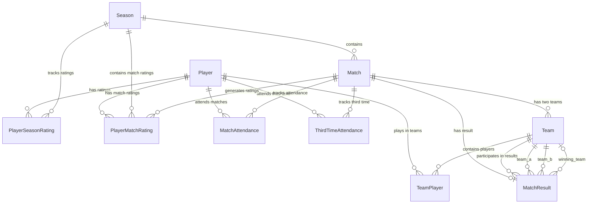

# Database Schema

This document describes the complete database schema for the Futsal Friends application.

## Overview

The database consists of **10 tables** organized into three main categories:
1. **Core Entities**: Players, Seasons
2. **Match Management**: Matches, Attendance, Teams, Results
3. **Rating System**: Player ratings at season and match levels

## Entity Relationship Diagram

## Tables

### 1. Player

Core player entity with minimal personal information.

**Columns:**
| Column | Type | Constraints | Description |
|--------|------|-------------|-------------|
| id | UUID | PK | Player unique identifier |
| name | VARCHAR(100) | NOT NULL, Indexed | Player name |
| is_active | BOOLEAN | NOT NULL, Default: true | Active status |
| created_at | TIMESTAMP | NOT NULL | Record creation time |
| updated_at | TIMESTAMP | NOT NULL | Last update time |

**Relationships:**
- One-to-many with `PlayerSeasonRating`
- One-to-many with `PlayerMatchRating`
- One-to-many with `MatchAttendance`
- One-to-many with `ThirdTimeAttendance`
- One-to-many with `TeamPlayer`

**Business Rules:**
- Player names should be unique (enforced at application level)
- Inactive players don't appear in active rosters

---

### 2. Season

Yearly season for organizing matches and tracking leaderboards.

**Columns:**
| Column | Type | Constraints | Description |
|--------|------|-------------|-------------|
| id | UUID | PK | Season unique identifier |
| name | VARCHAR(100) | NOT NULL | Season name (e.g., "2025 Season") |
| year | INTEGER | NOT NULL, Indexed | Season year |
| start_date | DATE | NOT NULL | Season start date |
| end_date | DATE | NULL | Season end date |
| is_active | BOOLEAN | NOT NULL, Default: true, Indexed | Active status |
| created_at | TIMESTAMP | NOT NULL | Record creation time |
| updated_at | TIMESTAMP | NOT NULL | Last update time |

**Relationships:**
- One-to-many with `Match`
- One-to-many with `PlayerSeasonRating`
- One-to-many with `PlayerMatchRating`

**Business Rules:**
- Only one season can be active at a time
- All player ratings reset to 3.0 at season start

---

### 3. PlayerSeasonRating

Player's current rating for a specific season.

**Columns:**
| Column | Type | Constraints | Description |
|--------|------|-------------|-------------|
| id | UUID | PK | Rating record identifier |
| player_id | UUID | FK → Player, NOT NULL, Indexed | Player reference |
| season_id | UUID | FK → Season, NOT NULL, Indexed | Season reference |
| current_rating | FLOAT | NOT NULL, Default: 3.0, Check: 1.0-5.0 | Current rating |
| matches_completed | INTEGER | NOT NULL, Default: 0 | Total matches in season |
| matches_attended | INTEGER | NOT NULL, Default: 0 | Matches actually attended |
| rating_locked | BOOLEAN | NOT NULL, Default: true | If true, rating stays at 3.0 |
| last_calculated_at | TIMESTAMP | NULL | Last calculation time |
| created_at | TIMESTAMP | NOT NULL | Record creation time |
| updated_at | TIMESTAMP | NOT NULL | Last update time |

**Constraints:**
- Unique constraint on (player_id, season_id)
- Check: current_rating between 1.0 and 5.0
- Check: matches_attended ≤ matches_completed

**Relationships:**
- Many-to-one with `Player`
- Many-to-one with `Season`

**Business Rules:**
- rating_locked = true for first 3 matches
- After 3 matches, rating_locked = false and rating starts changing
- Rating calculated from last 3 matches only

---

### 4. Match

Weekly futsal match.

**Columns:**
| Column | Type | Constraints | Description |
|--------|------|-------------|-------------|
| id | UUID | PK | Match unique identifier |
| season_id | UUID | FK → Season, NOT NULL, Indexed | Season reference |
| match_date | TIMESTAMP | NOT NULL, Indexed | Match date and time |
| status | ENUM | NOT NULL, Default: 'scheduled', Indexed | Match status |
| rsvp_deadline | TIMESTAMP | NULL | RSVP deadline |
| location | VARCHAR(200) | NULL | Match location |
| notes | TEXT | NULL | Additional notes |
| created_at | TIMESTAMP | NOT NULL | Record creation time |
| updated_at | TIMESTAMP | NOT NULL | Last update time |

**Enums:**
- **status**: scheduled, confirmed, completed, cancelled, unplayable

**Relationships:**
- Many-to-one with `Season`
- One-to-many with `MatchAttendance`
- One-to-many with `ThirdTimeAttendance`
- One-to-many with `Team` (exactly 2)
- One-to-one with `MatchResult`
- One-to-many with `PlayerMatchRating`

**Business Rules:**
- Must have exactly 2 teams when status = 'completed'
- Must have result when status = 'completed'
- UNPLAYABLE matches have no teams, result, or player ratings
- UNPLAYABLE matches can still have third time attendance

---

### 5. MatchAttendance

Match attendance tracking.

**Columns:**
| Column | Type | Constraints | Description |
|--------|------|-------------|-------------|
| id | UUID | PK | Attendance record identifier |
| match_id | UUID | FK → Match, NOT NULL, Indexed | Match reference |
| player_id | UUID | FK → Player, NOT NULL, Indexed | Player reference |
| attended | BOOLEAN | NOT NULL, Default: false | Actual attendance |
| created_at | TIMESTAMP | NOT NULL | Record creation time |
| updated_at | TIMESTAMP | NOT NULL | Last update time |

**Constraints:**
- Unique constraint on (match_id, player_id)

**Relationships:**
- Many-to-one with `Match`
- Many-to-one with `Player`

**Business Rules:**
- attended tracks actual participation
- Only attended players can be assigned to teams

---

### 6. Team

One of two teams in a match.

**Columns:**
| Column | Type | Constraints | Description |
|--------|------|-------------|-------------|
| id | UUID | PK | Team unique identifier |
| match_id | UUID | FK → Match, NOT NULL, Indexed | Match reference |
| name | ENUM | NOT NULL | Team identifier |
| average_skill_rating | FLOAT | NULL | Team average rating |
| created_at | TIMESTAMP | NOT NULL | Record creation time |

**Enums:**
- **name**: team_a, team_b

**Constraints:**
- Unique constraint on (match_id, name)

**Relationships:**
- Many-to-one with `Match`
- One-to-many with `TeamPlayer`
- One-to-many with `MatchResult` (as team_a, team_b, or winning_team)

**Business Rules:**
- Each match has exactly 2 teams
- average_skill_rating calculated when team is created
- Used for balanced team creation

---

### 7. TeamPlayer

Junction table for team-player assignments.

**Columns:**
| Column | Type | Constraints | Description |
|--------|------|-------------|-------------|
| id | UUID | PK | Assignment identifier |
| team_id | UUID | FK → Team, NOT NULL, Indexed | Team reference |
| player_id | UUID | FK → Player, NOT NULL, Indexed | Player reference |
| position | VARCHAR(50) | NULL | Player position (optional) |
| created_at | TIMESTAMP | NOT NULL | Record creation time |

**Constraints:**
- Unique constraint on (team_id, player_id)

**Relationships:**
- Many-to-one with `Team`
- Many-to-one with `Player`

**Business Rules:**
- Player can only be on one team per match
- Player must have attended match (MatchAttendance.attended = true)

---

### 8. MatchResult

Match outcome and scores.

**Columns:**
| Column | Type | Constraints | Description |
|--------|------|-------------|-------------|
| id | UUID | PK | Result identifier |
| match_id | UUID | FK → Match, NOT NULL, Unique, Indexed | Match reference |
| team_a_id | UUID | FK → Team, NOT NULL | Team A reference |
| team_b_id | UUID | FK → Team, NOT NULL | Team B reference |
| team_a_score | INTEGER | NOT NULL | Team A score |
| team_b_score | INTEGER | NOT NULL | Team B score |
| winning_team_id | UUID | FK → Team, NULL | Winning team (null for draw) |
| result_type | ENUM | NOT NULL | Result type |
| recorded_at | TIMESTAMP | NOT NULL | When result was recorded |
| created_at | TIMESTAMP | NOT NULL | Record creation time |
| updated_at | TIMESTAMP | NOT NULL | Last update time |

**Enums:**
- **result_type**: win, draw

**Relationships:**
- One-to-one with `Match`
- Many-to-one with `Team` (team_a_id)
- Many-to-one with `Team` (team_b_id)
- Many-to-one with `Team` (winning_team_id, nullable)

**Business Rules:**
- One result per match
- winning_team_id is null when result_type = 'draw'
- result_type automatically determined from scores

---

### 9. ThirdTimeAttendance

Post-match social gathering attendance.

**Columns:**
| Column | Type | Constraints | Description |
|--------|------|-------------|-------------|
| id | UUID | PK | Attendance identifier |
| match_id | UUID | FK → Match, NOT NULL, Indexed | Match reference |
| player_id | UUID | FK → Player, NOT NULL, Indexed | Player reference |
| attended | BOOLEAN | NOT NULL, Default: true | Attendance status |
| created_at | TIMESTAMP | NOT NULL | Record creation time |

**Constraints:**
- Unique constraint on (match_id, player_id)

**Relationships:**
- Many-to-one with `Match`
- Many-to-one with `Player`

**Business Rules:**
- Independent from match attendance
- Players can attend third time even if they didn't play
- Provides bonus rating points (for completed matches)
- Can be recorded for UNPLAYABLE matches (counts for leaderboard points)

---

### 10. PlayerMatchRating

Complete rating history for each player at each match.

**Columns:**
| Column | Type | Constraints | Description |
|--------|------|-------------|-------------|
| id | UUID | PK | Rating record identifier |
| player_id | UUID | FK → Player, NOT NULL, Indexed | Player reference |
| match_id | UUID | FK → Match, NOT NULL, Indexed | Match reference |
| season_id | UUID | FK → Season, NOT NULL, Indexed | Season reference |
| match_number | INTEGER | NOT NULL, Check: > 0 | Sequential match number |
| match_date | TIMESTAMP | NOT NULL, Indexed | Match date |
| attended_match | BOOLEAN | NOT NULL | Match attendance |
| attended_third_time | BOOLEAN | NOT NULL, Default: false | Third time attendance |
| match_result | ENUM | NOT NULL | Player's match outcome |
| team_average_rating | FLOAT | NULL | Player's team avg rating |
| opponent_average_rating | FLOAT | NULL | Opponent team avg rating |
| rating_before | FLOAT | NOT NULL, Check: 1.0-5.0 | Rating before match |
| rating_after | FLOAT | NOT NULL, Check: 1.0-5.0 | Rating after match |
| rating_change | FLOAT | NOT NULL | Rating delta |
| elo_k_factor | FLOAT | NOT NULL | K-factor used |
| attendance_bonus | FLOAT | NOT NULL, Default: 0.0 | Attendance bonus applied |
| third_time_bonus | FLOAT | NOT NULL, Default: 0.0 | Third time bonus applied |
| non_attendance_penalty | FLOAT | NOT NULL, Default: 0.0 | Penalty if didn't attend |
| calculated_at | TIMESTAMP | NOT NULL | Calculation timestamp |
| created_at | TIMESTAMP | NOT NULL | Record creation time |

**Enums:**
- **match_result**: win, draw, loss, did_not_attend

**Constraints:**
- Unique constraint on (player_id, match_id)
- Check: rating_before between 1.0 and 5.0
- Check: rating_after between 1.0 and 5.0
- Check: match_number > 0
- Composite index on (player_id, season_id, match_date DESC) for efficient "last 3 matches" queries

**Relationships:**
- Many-to-one with `Player`
- Many-to-one with `Match`
- Many-to-one with `Season`

**Business Rules:**
- Created for ALL season players after each completed match
- NOT created for UNPLAYABLE matches
- rating_change = 0 for first 3 matches
- Non-attendees get penalty recorded
- Full transparency on rating calculation

---

## Indexes

Key indexes for performance:

- **Player**: name
- **Season**: year, is_active
- **Match**: season_id, match_date, status
- **PlayerSeasonRating**: player_id, season_id
- **MatchAttendance**: match_id, player_id
- **Team**: match_id
- **TeamPlayer**: team_id, player_id
- **MatchResult**: match_id
- **ThirdTimeAttendance**: match_id, player_id
- **PlayerMatchRating**: player_id, match_id, season_id, match_date
- **PlayerMatchRating Composite**: (player_id, season_id, match_date DESC) - for last 3 matches queries

## Data Integrity

### Referential Integrity
- All foreign keys have `ON DELETE CASCADE` to maintain data consistency
- Deleting a season deletes all related matches, ratings, etc.

### Check Constraints
- Rating values constrained to 1.0 - 5.0 range
- Match attendance count validations
- Match number must be positive

### Unique Constraints
- One season rating per player per season
- One match attendance record per player per match
- One third time record per player per match
- One team assignment per player per team
- One result per match
- One rating record per player per match

## Migration History

| Version | Date | Description |
|---------|------|-------------|
| 0a8702210b54 | 2025-11-01 | Initial database schema with all 10 tables |
| 6058a914c2b8 | 2025-11-08 | Add match_week column to matches |
| 2270fe0f8d73 | 2025-11-08 | Add player_type to players |
| efb10028c48c | 2025-11-14 | Remove RSVP columns from match_attendances |
| add_unplayable_status | 2026-02-07 | Add unplayable status to match_status enum |

See [Database Migrations](migrations.md) for migration management details.
